## this is a writeup

打开首页发现是一个登陆页面，猜测是一个SQL注入，简单输入一个单引号发现过滤了，那么应该是有SQL注入。

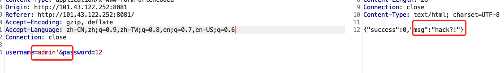

简单FUZZ了一下，过滤了`select、substr、mid、left、sleep`等等截断函数。

登陆只提示：**登陆或密码错误！**同时过滤了大部分截断函数,考虑使用时间盲注，那首先就是要**构造闭合**。

过滤了`'、" ｜ ...`，尝试利用`\`逃逸单引号,直接看似乎看不出来有没有闭合成功。通过判断字段来确定是否闭合成功，但是order被过滤了。

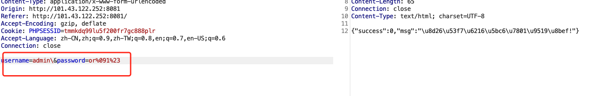

因为`select`被过滤且`union`没有过滤判断可能是考mysql8注入,就可以利用`union values row()`来判断字段数

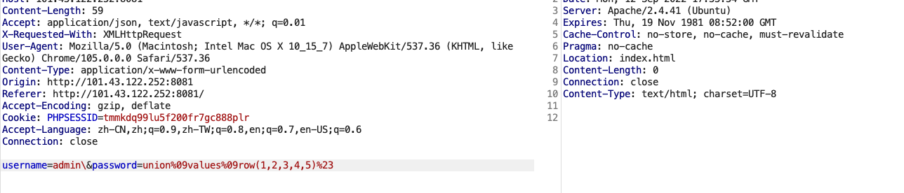

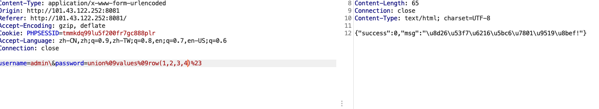

利用这种方式发现注入成功，也猜测出字段数量，因为过滤了`select`联合查询不能够使用，`if、sleep、benchmark`也被过滤了。

还是需要通过`union values row()`来构造，`if`被过滤了可以用`case..when...else..end`替代，没有可以利用的延时函数，可以参考虎符2022初赛和CISCN2022初赛的SQL注入溢出和报错的方式。

利用这个思路可以构造payload：

```
username=admin\&password=union%09values%09row(1,2,3,case%09when(1)then(~0%2b1)else(3)end)%23
```

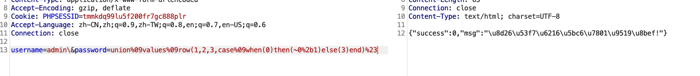

无回显的情况，如下：

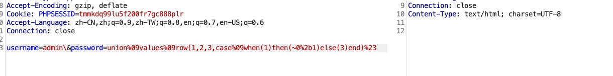

因为table没有过滤，所以接下来就是使用mysql8的table注入。

```
username=admin\&password=union%09values%09row(1,2,3,case%09when((binary%090x26,2)>(table%09information_schema.TABLESPACES_EXTENSIONS%09limit%096,1))then(~0%2b1)else(3)end)%23
```

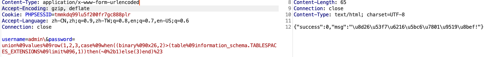

所以我们可以编写脚本猜解：数据库名/表名：


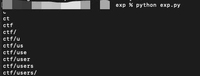

因为是利用`>`,所以在最后一位的时候要+1，最后的结果应为`Flag_Account`

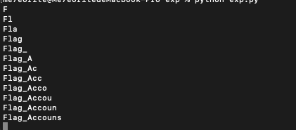

获取用户密码

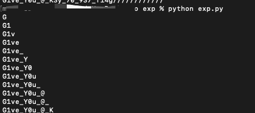

这里有一个坑点，因为最后一位需要+1，但是在ascii为32的时候，它为空，后面这里有个空格。

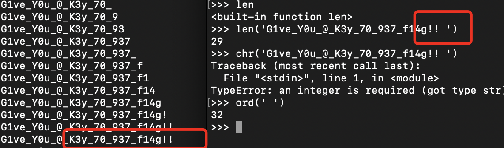

需要注意的是 **数据库中的账号多个账号**，那么利用该账号登陆： `Flag_Account/G1ve_Y0u_@_K3y_70_937_f14g!!!`。

登陆后没什么反应，**扫描目录**发现存在`flag.php`

```php
<?php
session_start();

if(isset($_SESSION['name'])){
    if($_SESSION['name'] === 'Flag_Account'){
        if(!preg_match('/^\/flag|var|tmp/i',$_GET['file'])){
            include $_GET['file'];
    }else{
        echo 'try again~';
    }
    }
        show_source(__FILE__);
    
}else{
    echo '登陆一下吧~';
}
```

过滤了开头`/flag`,这个位置只需要利用`/proc/self/root/flag`绕过

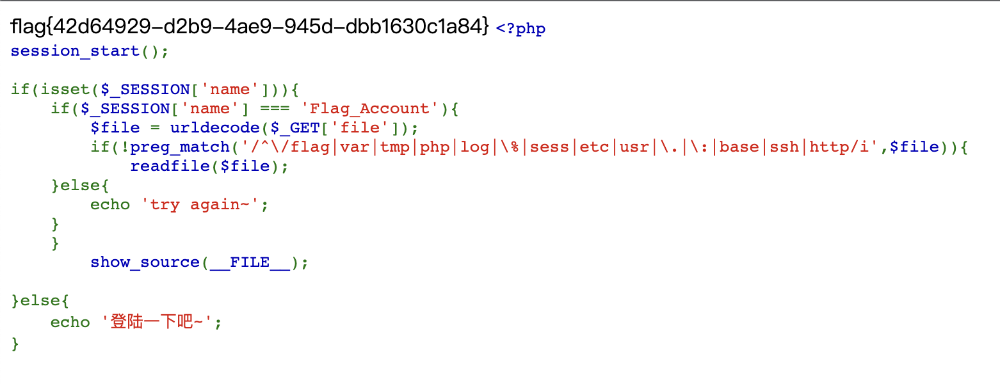


